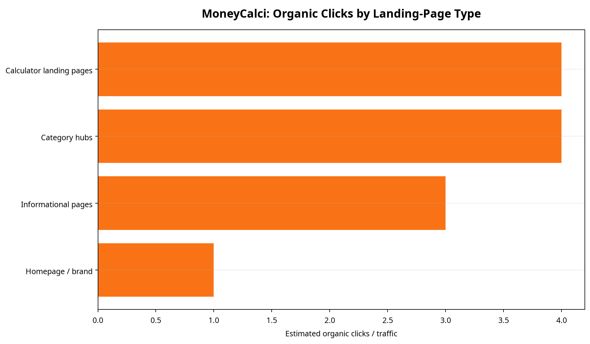
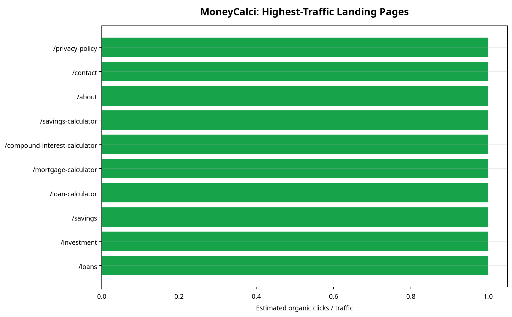

# تقرير المنافسة في SEO: moneycalc-pqpzjtta.manus.space

**إعداد:** Manus AI  
**التاريخ:** 26 أغسطس 2026  
**النطاق المستهدف:** [MoneyCalci](https://moneycalc-pqpzjtta.manus.space/)  
**مصادر البيانات الأساسية:** زحف عام للصفحات المنشورة، صفحات المنافسين العامة، وملاحظات تحليلية وملفات جرد مطبّعة. لم تتوفر صادرات Ahrefs أو Semrush أو Similarweb أو Google Search Console في مساحة العمل؛ لذلك لا يتضمن هذا التقرير أرقامًا مؤكدة للزيارات العضوية أو الترتيبات أو الروابط الخلفية.

> **ملاحظة منهجية:** هذا تقرير استخبارات تنافسية يصف ما يفعله الموقع المستهدف وموقعه الظاهر مقارنة بالمنافسين. الرسوم المعروضة التي تحمل تسميات traffic/clicks مبنية هنا على **جرد بنيوي للصفحات المرصودة** وليست بيانات نقرات أو زيارات فعلية.[1] [2]

## السرد التنفيذي

**MoneyCalci في مرحلة بصمة SEO مبكرة، واستراتيجيته الظاهرة هي بناء صفحات آلات حاسبة منفصلة بدل الاعتماد على الصفحة الرئيسية وحدها.** الزحف العام يثبت وجود صفحة رئيسية، أربعة مسارات فئات، وأربع صفحات حاسبة رئيسية للقروض والرهن والفائدة المركبة والادخار، مع عناوين H1 واضحة، حقول تفاعلية، صيغ، شرح، أسئلة شائعة، وروابط داخلية.[1] هذا يعطي الموقع أساسًا مناسبًا لصفحات نية بحث مباشرة، لكن البيانات المتاحة لا تثبت بعد وجود ظهور عضوي أو حصة نقرات قابلة للقياس.

**المشهد التنافسي يهيمن عليه منافسون أوسع بكثير من حيث الاتساع الموضوعي والبنية التحريرية.** Calculator.net يعرض قائمة كثيفة من الآلات الحاسبة المالية عبر الرهن والاستثمار والتقاعد والضرائب والديون، بينما يربط Bankrate الآلات الحاسبة بصفحات معدلات ومنتجات وقطاعات مالية، وتدمج NerdWallet الآلات الحاسبة مع المحتوى الإرشادي والإفصاحات التجارية والثقة التحريرية.[2] [3] [4] لذلك تعتمد MoneyCalci حاليًا على وضوح التجربة وجودة القالب أكثر من اعتمادها على اتساع الفهرس أو سلطة العلامة.

---

# الجزء الأول: الأداء العضوي وبصمة البحث

## 1. سياق النشاط واستراتيجية SEO الحالية

**الاستراتيجية الحالية لـ MoneyCalci هي استراتيجية utility-led تعتمد على صفحات حاسبة قابلة للتكرار.** الصفحة الرئيسية توجه المستخدم إلى فئات Money & Finance وLoans & Credit وInvestment وSavings، ثم إلى صفحات مستقلة للقرض والرهن والفائدة المركبة والادخار.[1] صفحة القرض، على سبيل المثال، تجمع بين H1 مطابق للنية، واجهة حساب، نتيجة فورية، صيغة، شرح، FAQ، وروابط لآلات مرتبطة.[1]

| العنصر | الدليل المرصود | القراءة التنافسية |
| --- | --- | --- |
| الصفحة الرئيسية | رسالة واضحة: “Free calculators for smarter money decisions” وروابط للفئات والأدوات | تمثل مدخل العلامة وتجمع النوايا، لكنها لا تغطي وحدها الطلب الطويل الذيل.[1] |
| صفحات الفئات | `/calculators` و`/finance` و`/loans` و`/investment` و`/savings` | بداية لهيكل hub-and-spoke، مع بصمة أصغر من المنافسين.[1] |
| صفحات الأدوات | `/loan-calculator` و`/mortgage-calculator` و`/compound-interest-calculator` و`/savings-calculator` | تستهدف نيات بحث محددة وتعرض تجربة حساب فعلية.[1] |
| المحتوى الداعم | صيغ، شرح، FAQ، related calculators، وملاحظة تعليمية | يضيف سياقًا قابلًا للفهرسة والثقة، لكنه لا يساوي بعد قاعدة المحتوى التحريري لدى المنافسين.[1] |
| قابلية الزحف الظاهرة | طلب `/sitemap.xml` أعاد صفحة 404 أثناء الجمع | لا يمكن من الزحف العام إثبات وجود sitemap XML متاح في هذا المسار.[1] |

## 2. تحليل أنواع الصفحات: أين يتركز العرض العضوي؟

**البصمة المرصودة تتركز بالتساوي تقريبًا بين صفحات الحاسبات وصفحات الفئات، لا بين عدد كبير من الصفحات المتخصصة.** في جرد MoneyCalci الحالي، تم رصد 4 صفحات حاسبة و4 صفحات فئات وصفحة رئيسية و3 صفحات معلوماتية. هذه نسب من **عدد الصفحات المرصودة** وليست نسب traffic؛ لا توجد بيانات عضوية تسمح بتحويلها إلى حصة نقرات.[1] [2]

| نوع الصفحة | أمثلة | الحصة من الجرد المرصود | التفسير |
| --- | --- | ---: | --- |
| صفحات آلات حاسبة | loan, mortgage, compound interest, savings | 4/12 = 33.3% | هي أصل القيمة المباشرة ونقطة التقاط النية العالية. |
| صفحات فئات | calculators, finance, loans, investment, savings | 4/12 = 33.3% تقريبًا وفق الجرد التحليلي | تؤدي دور hub داخلي، لكن عمقها الموضوعي أقل بكثير من المنافسين. |
| صفحات معلوماتية/ثقة | about, contact, privacy-policy | 3/12 = 25.0% | تدعم الثقة والامتثال أكثر من التقاط الطلب الحسابي. |
| الصفحة الرئيسية/العلامة | `/` | 1/12 = 8.3% | بوابة للعلامة والتنقل، وليست بديلًا عن صفحات الأدوات. |

**الصفحات الحالية مصممة لتقليل الاحتكاك بعد الوصول من البحث.** صفحة القرض تعرض الحقول والنتيجة في نفس الشاشة، وتستخدم عنوانًا ووصفًا خاصين بالمسار، ثم تضيف الصيغة والأسئلة الشائعة والروابط ذات الصلة.[1] لا يمكن للبيانات العامة وحدها تحديد ما إذا كان هذا القالب يحقق ترتيبًا أو معدل نقر أعلى.

## 3. الظهور حسب الدولة

**لا توجد بيانات دولة قابلة للتحقق في المصادر المتاحة.** السوق المقصود في مواصفات المنتج هو الولايات المتحدة، مع أسواق ثانوية في المملكة المتحدة وكندا وأستراليا، لكن لم تتوفر صادرات حسب الدولة أو بيانات GSC أو Similarweb تسمح بقياس traffic أو keyword footprint أو اتجاهات زمنية.[1] لذلك لا ينبغي استنتاج أن دولة معينة تقود الظهور أو أن الموقع متعدد اللغات؛ الصفحات المرصودة باللغة الإنجليزية فقط.

| الدولة/السوق | الدليل المتاح | ما يمكن قوله |
| --- | --- | --- |
| الولايات المتحدة | السوق الأساسي في مواصفات المنتج، دون بيانات قياس | نية السوق واضحة، لكن الحصة العضوية غير قابلة للقياس من المصادر الحالية. |
| المملكة المتحدة/كندا/أستراليا | أسواق ثانوية في مواصفات المنتج، دون صفحات محلية مرصودة | لا يوجد دليل عام كافٍ على استراتيجية localization مستقلة. |
| دول أخرى | لا توجد صادرات أو بيانات دولة | لا يمكن تأكيد أي انتشار جغرافي. |

## 4. اتجاه الزيارات العضوية

**لا يمكن تحديد ما إذا كان MoneyCalci ينمو أو ينخفض عضويًا.** لا يوجد ملف traffic trend أو سجل ستة أشهر من أداة خارجية أو بيانات Search Console في مساحة العمل. وقد أدى تشغيل مولّد الرسوم إلى تخطي رسم الاتجاه العالمي ورسم اتجاه الدول بسبب غياب ملفات المصدر.[2]

غياب الاتجاه ليس دليلًا على غياب الزيارات؛ هو فقط حدّ قياس. ما يمكن إثباته هو أن الموقع المنشور متاح، وأن الصفحات العامة قابلة للقراءة وتحتوي على بنية حاسبة ومحتوى داعم.[1]

## 5. البحث المرتبط بالعلامة مقابل غير المرتبط بها

**لا تتوفر عينة كلمات مفتاحية تسمح بفصل branded عن non-branded.** عناوين الصفحات ومساراتها تستهدف عبارات عامة مثل “loan calculator” و“mortgage calculator” و“compound interest calculator”، بينما اسم MoneyCalci يظهر في العنوان العام وفي تذييل الصفحات.[1] هذا يصف intent التصميمي للموقع، وليس حصة النقرات بين العلامة والعبارات العامة.

وبالمقارنة، يستخدم Calculator.net أسماء حاسبات مباشرة ومتكررة على نطاق واسع، وتستخدم NerdWallet عناوينًا أطول ذات صياغة تعليمية مثل “How Much Will Protect You?” و“Estimate Your Costs”، بينما يربط Bankrate الأدوات بعناقيد مالية وتجارية أوسع.[2] [3] [4] لا يمكن من الزحف العام تحديد أي صياغة تحقق نقرات أكثر.

---

# الجزء الثاني: أدلة استراتيجية الروابط الخلفية

## 6. الروابط الخلفية: كيف تبني MoneyCalci سلطتها؟

**لا توجد أدلة روابط خلفية قابلة للقياس في المصادر المتاحة.** لم تتوفر بيانات referring domains أو anchor text أو destination mix من Ahrefs أو Semrush أو أدوات مماثلة، لذلك لا يمكن تصنيف نمط الروابط بأنه homepage-led أو PR-led أو SEO-page-led.[2]

ما يمكن قراءته من الموقع نفسه هو **استراتيجية ربط داخلي واضحة**: الصفحة الرئيسية تربط بالفئات والأدوات، وصفحات الأدوات تربط بآلات مرتبطة وبصفحة الأدوات العامة.[1] هذه بنية توزيع داخلية قابلة للرصد، لكنها لا تثبت اكتساب روابط خارجية أو سلطة نطاق.

---

# الجزء الثالث: التقييم الاستراتيجي

## 7. الاعتمادات ونقاط التعرض

**اعتماد MoneyCalci الأكبر حاليًا هو عدد صغير من صفحات الأدوات وقالب واحد مشترك.** هذا يمنح التجربة اتساقًا وسرعة في الإطلاق، لكنه يعني أيضًا أن البصمة العضوية الظاهرة تعتمد على أربع نيات أساسية فقط: القرض، الرهن، الفائدة المركبة، والادخار.[1]

في المقابل، يعتمد Calculator.net على اتساع هائل من الصفحات ذات المطابقة المباشرة، ويعتمد Bankrate على دمج الآلة الحاسبة مع المعدلات والمنتجات والمحتوى المالي، بينما تعتمد NerdWallet على شبكة أوسع من الأدوات والمقالات والإفصاحات والبنية التجارية.[2] [3] [4] الفارق المرصود هو فرق **حجم وتنوع وتراكم**، وليس دليلًا منفردًا على تفوق ترتيب أو أداء.

| محور المقارنة | MoneyCalci | Calculator.net | Bankrate | NerdWallet |
| --- | --- | --- | --- | --- |
| الاتساع المرصود | 4 أدوات أساسية + فئات | عشرات الأدوات المالية المتخصصة | عناقيد أدوات متعددة مع معدلات ومنتجات | عناقيد أدوات + محتوى تعليمي وتجاري |
| نمط الصفحة | أداة تفاعلية مع شرح وFAQ | قائمة كثيفة وصفحات exact-match | hub تسويقي/تحريري | hub تحريري/تجاري |
| الثقة الظاهرة | شرح، افتراضات، disclaimer | علامة قديمة، sitemap/footer links ظاهر | إفصاحات ومنتجات مالية | advertiser disclosure، editorial guidelines، تراخيص وإفصاحات |
| الروابط الداخلية | فئات وأدوات مرتبطة | كثافة ربط عالية بين فئات كثيرة | ربط الأدوات بالأسواق والمنتجات | ربط الأدوات بالمقالات والقطاعات |
| بيانات الأداء | غير متاحة | غير متاحة في هذا التقرير | غير متاحة في هذا التقرير | غير متاحة في هذا التقرير |

**أهم نقطة تعرض هي أن الأداء العضوي—إن وجد—لن يكون قابلًا للتنويع داخل البصمة الحالية إلا بدرجة محدودة.** لا توجد صفحات salary أو tax أو business أو ecommerce أو shipping منشورة في الجرد الذي تم تحليله، رغم أن مواصفات المنتج الأصلية تشير إلى طموح أوسع. هذه ملاحظة عن نطاق الإصدار المنشور، وليست توصية تنفيذية.

## حدود البيانات

لم يتضمن التقرير تقديرات زيارات أو ترتيب أو حصص دول أو backlinks؛ جميع هذه الحقول تتطلب صادرات أو وصولًا إلى أدوات قياس لم تكن متاحة. كما أن الرسوم لا تمثل traffic حقيقيًا، بل عددًا بنيويًا للصفحات المرصودة بهدف إظهار تركيبة الموقع. ينبغي قراءة النتائج كخط أساس زحف عام وتحليل منافسين نوعي، لا كبديل عن بيانات GSC أو Ahrefs أو Semrush أو Similarweb.[1] [2]

## References

[1]: ../seo-analysis_notes.md "MoneyCalci public crawl notes and evidence log, collected August 26, 2026"
[2]: https://www.calculator.net/financial-calculator.html "Calculator.net Financial Calculators, accessed August 26, 2026"
[3]: https://www.bankrate.com/calculators/ "Bankrate Financial Calculator hub, accessed August 26, 2026"
[4]: https://www.nerdwallet.com/finance/calculators "NerdWallet Financial Calculators, accessed August 26, 2026"
[5]: ../seo-analysis/charts/asset_manifest.md "Generated SEO chart asset manifest and missing-input log"
